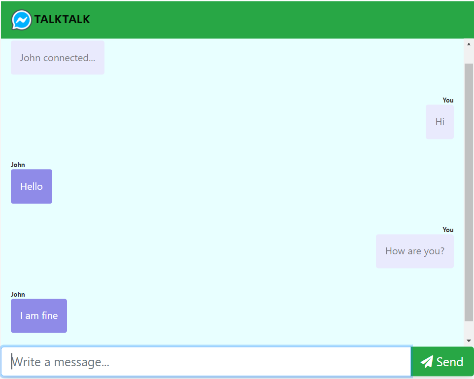

# Realtime-chatApp-using-socket.io - TALKTALK
- It is a Realtime Chatting Application that provides an interface for multiple user chatting at the same time.
- FrontEnd Technologies- HTML, CSS
- BackEnd Technologies- JavaScript, Node.js
- Used Socket.io module for a two-way connection between client and server.

# Process to run the app
- Install node.js
- run npm server.js
- you see the application running on port 3000 by typing url localhost:3000 in your browser.

